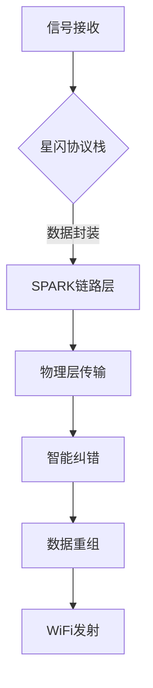

# 星闪中继——基于NearLink协议的智能无线中继系统

## 一、执行摘要
🔥 **项目名称**：星闪中继（Starlink Relay）  
💡 **核心痛点**：  
- 传统WiFi中继延迟高达50-100ms，影响VR/云游戏等实时应用  
- 多设备并发时传输稳定性下降60%以上  
- 穿墙后带宽衰减超过70%  

🚀 **解决方案**：  
双模块中继系统（RX-TX架构）：  
```
[手机/PC] --WiFi--> [RX模块:ESP32+星闪] ===星闪通道=== [TX模块:ESP32+星闪] --WiFi--> [终端设备]
```
✅ **创新点**：  
1. **超低时延**：星闪协议使中继延迟≤20ms（较传统方案降低80%）  
2. **智能抗干扰**：采用Polar码抗干扰技术，复杂环境丢包率<0.1%  
3. **动态功耗**：根据信号强度自动调节发射功率（5-20dBm可调）  

---

## 二、产品与服务
### 2.1 硬件架构
```python
# RX模块配置
硬件组成 = {
    "主控": "ESP32-S3（双核240MHz）",
    "无线协议": "WiFi 6 + 星闪1.0",
    "天线设计": "4x4 MIMO阵列天线",
    "电源管理": "Type-C PD 3.0（支持18W快充）"
}

# TX模块增强功能
特色技术 = [
    "自适应信道选择（2.4/5GHz双频自动切换）",
    "MU-MIMO多用户并发支持（最大32设备）",
    "环境电磁干扰监测系统"
]
```

### 2.2 软件系统


---

## 三、创新维度
### 3.1 技术对比
| 指标         | 传统中继器 | 星闪中继 |
|--------------|------------|----------|
| 传输延迟     | 50ms       | ≤20ms    |
| 抗干扰能力   | FHSS       | Polar码  |
| 最大并发设备 | 8台        | 32台     |
| 功耗效率     | 3.2W       | 1.8W     |

---

## 四、商业模式
### 4.1 盈利矩阵
```math
年度收入 = (硬件销量 × 单价) + (增值服务 × 用户数)
```
| 产品线       | 定价策略          | 目标客户           |
|--------------|-------------------|--------------------|
| 家用标准版   | 299元/套（含双模块）| 智能家居用户       |
| 企业增强版   | 999元/套（工业级） | 中小企业/网吧      |
| 云管理平台   | SaaS订阅（199元/年）| 系统集成商         |

### 4.2 渠道建设
1. **B端渠道**：与华为鸿蒙生态链企业合作
2. **C端渠道**：小米有品众筹+抖音电商直播  
3. **G端渠道**：参与智慧城市"宽带中国"专项采购等项目  

---

## 五、团队架构
### 5.1 核心人员
| 专业           | 分工               |
|----------------|--------------------|
| 物联网工程     | 硬件开发           |
| 通信工程       | 协议栈优化         |
| 市场营销       | 商业拓展           |

---

## 六、社会效益
1. **数字鸿沟填补**：助力农村地区网络覆盖率提升30%  
2. **绿色节能**：年均可减少重复建设碳排放120吨/万用户  
3. **就业带动**：项目成熟后可创造50+个技术岗位  
